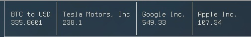

Personal Terminal Widget Library
--------------------------------

Currently only renders stock info from Yahoo in a simple way. Stock widgets
automatically update periodically.

Context is written exclusively in Go and has zero non-Go dependencies.
Shoutout to the excellent Termbox-Go project: github.com/nsf/termbox-go
